## 1.基本概念

### 1.1多机多卡的分布式训练

- 单机中**CPU** <-> **GPU** 通信 通过PCIe完成  ， 存在耗时

- 单机中**GPU** <-> **GPU** 多个数据，在不同卡训练需要进行**gratigent allgather(梯度全聚)** 使用NVLink进行通信

- 多机中**CPU** <-> **CPU** 通信 通过通信网络完成  ，例如 GPU1->CPU1->CPU2->GPU2

- 多机中**GPU** <-> **GPU** 通信 通过通信网络完成 ，不走CPU，NVLink直接在PEIe总线给不同GPU通信。

### 1.2显存占用问题

- W 模型参数
- O 优化参数  adam ， adamW 的（Momentum， Variatnce）
- G 梯度
- activation : 前向计算保存的激活值 ， 用于进行backward 
- Temporary buffers ： 用于保存梯度聚合
- Unusable frament memory ：显存的碎片

3. 显存优化的思路：

   以时间来换空间 

### 1.3显存优化的库以及方向

1. 常见的架构

​	deepspeed Megatron Ray

2. 优化技术

- 多卡的数据并行
- 多机分布式并行
- ZeRO零冗余优化（优化显存，提高训练的吞吐量）
- 流水线并行
- 张量并行
- RLHF并行训练

### 1.4分布式训练的目标

- 精度方面：

混合精度的fp32/fp16

异步梯度更新，非全局SGD

- 速度

GPU利用率的计算

完成的一个分布式系统训练一个完整LLM的时间

单位时间内训练  tokens/s

## 2.数据并行

### 2.1 数据并行图示例

- 所有GPU加载的模型权重w是一样的，不同的数据计算不同 $x_i$ 并得到 $ G_i $ 
- 主节点GPU1当server来汇总(AllReduce)所有的梯度，并反向传播给所有GPU的w更新权重

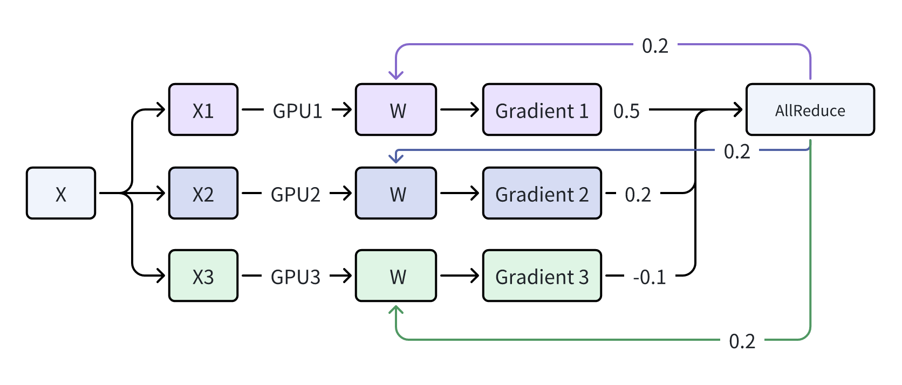

**限制：**

- GPU1在汇总梯度的时候，需要承担通信负载的时间，其他的节点只能进行等待
- 通信耗时为t ，那么三个梯度传递时间为(3 - 1)t ，将gradient回传又花费(3-1)t ,总共的耗时为(3 - 1)2t。 

## 3.分布式并行

### 3.1 异步并行

> 思路：
>
> 每个GPU逐次去做server
>
> GPU参数异步去更新
>
> 图示展示的关键步骤为：梯度计算的时候累积 ，之后呢一个接着计算梯度，只更新server的梯度，其他的去自行计算梯度 ， 更换server接着累积梯度，再去更新

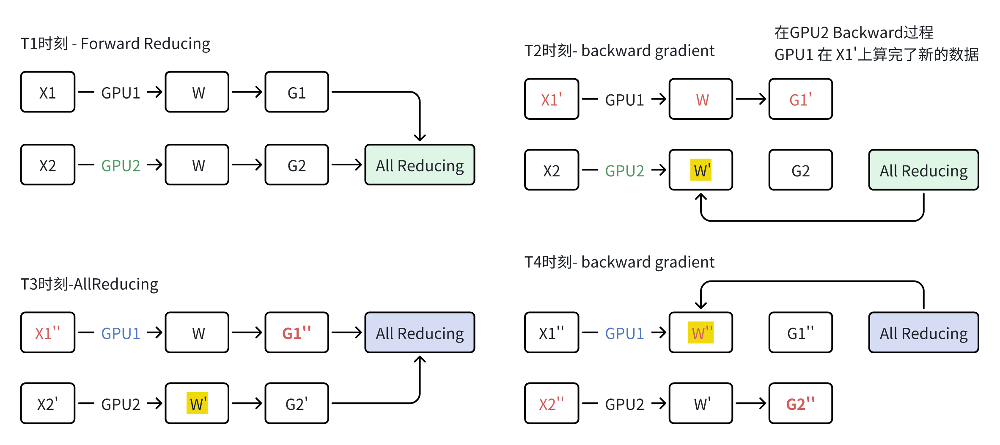**限制：**

GPU数量增大的时候，异步的步调会很大， 导致结果的W差异会比较大， 会难以收敛

### 3.2 分布式数据并行Ring-AllReduce(常用)

两个阶段的 **reduce-scatter** 和 **all-gather**

1. 数据切分 

>  将一个大的batch 切分成GPU数量的minibatch

2. reduce-scatter

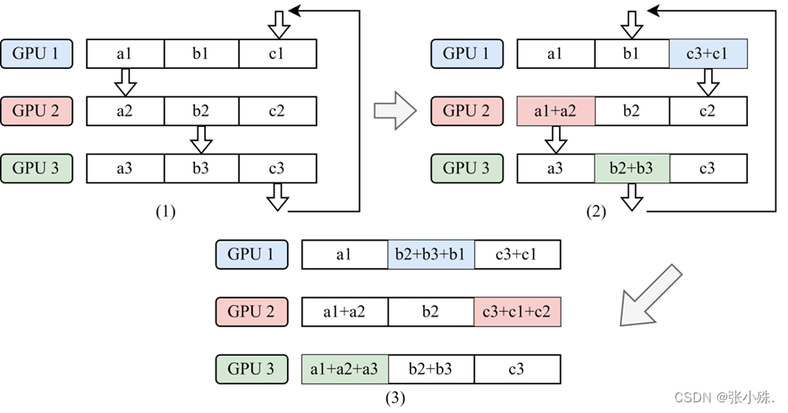

- step1：每个卡里面负责处理不同的minibatch

- step2：从不同的起始位置开始进行运算

- step3：若干步之后得到mini的梯度

3. Allgather

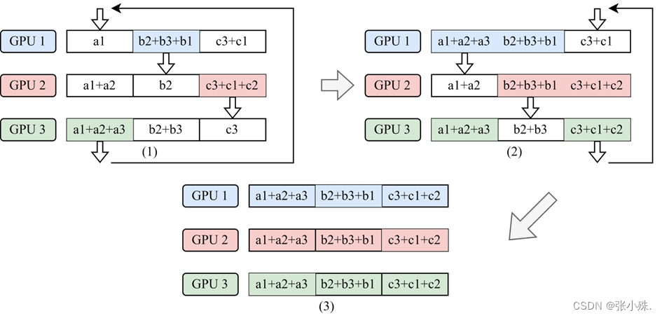

## 4.DeepSpeed ZeRO并行

### 4.1 模型训练显存占用分析

ZeRO:(Zero Redundancy Optimizer) 称为零冗余优化 ，关键算法

- 当前分布式并行问题：每个GPU都要加载相同参数矩阵，存在巨大的冗余显存负载
- 这里也可以是Adam-cpu优化

以参数量为Ψ的模型：

**Float16**的**参数**和**梯度** 分别消耗了 2Ψ + 2Ψ bytes的字节，

**Float32**的**参数**、**Monmentum**和**Variance** 分别消耗了 3 * 4Ψ的字节  总计为16Ψ - Bytes的内存

### 4.2 ZeRo-3 Stage

1. **ZeRO-1: ** 分割Optimizer State 

2. **ZeRO-2: ** 分割Optimizer State 与 Gradient 

3. **ZeRO-3: ** 分割Optimizer State 、Gradient 和 Parameters

   原则：

   “用完就删”

   “需要的时候去取”

   **Optimizer State ：** 参数、Momentum、Variance

#### 4.2.0 数据的切分

- 将原始的参数铺平成为1维

- 每个worker 根据自己的rank找到自己在一维中的起始和终止位置， 然后拷贝相应的数据

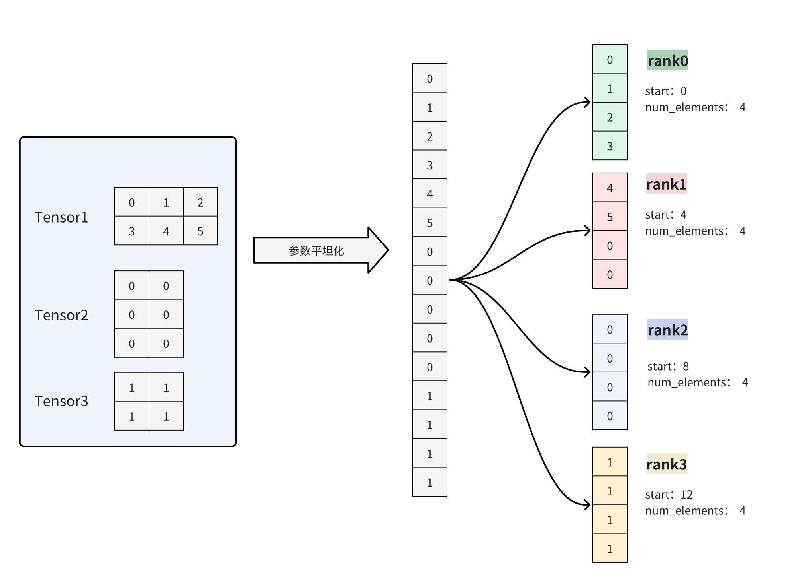

#### 4.2.1 ZeRO-1

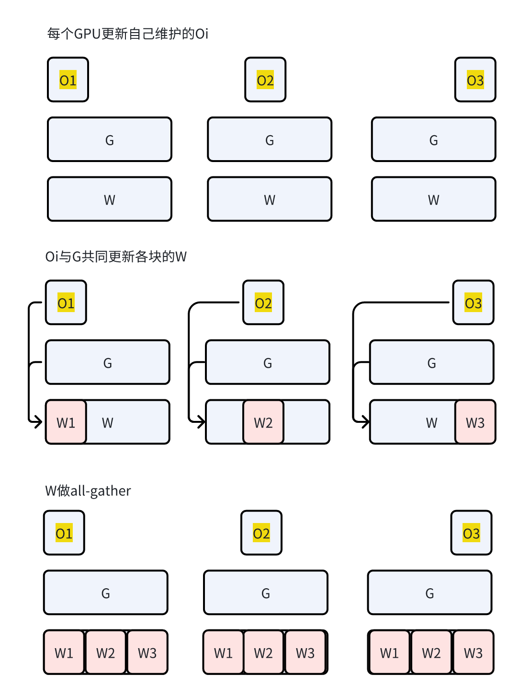

#### 4.2.2 ZeRO-2

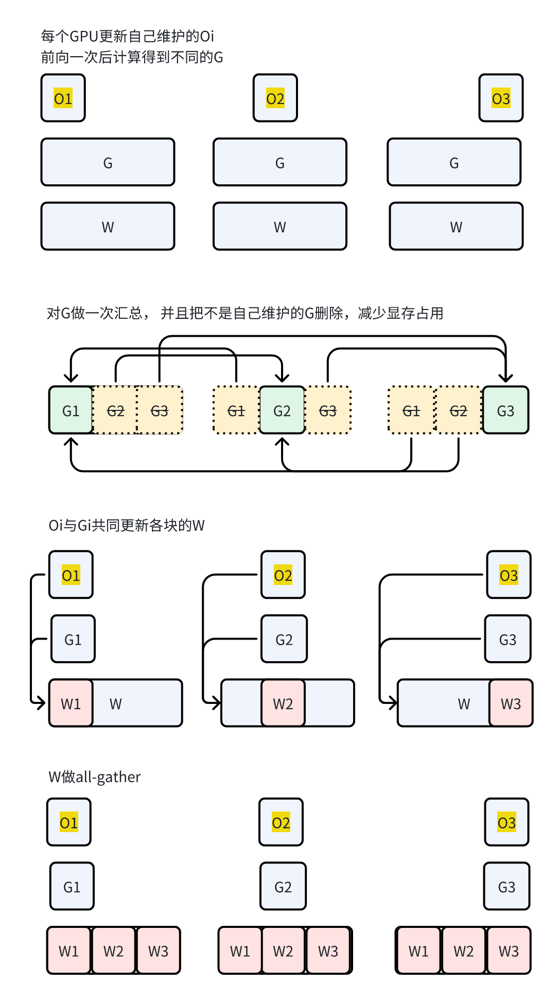

#### 4.2.3 ZeRO-3

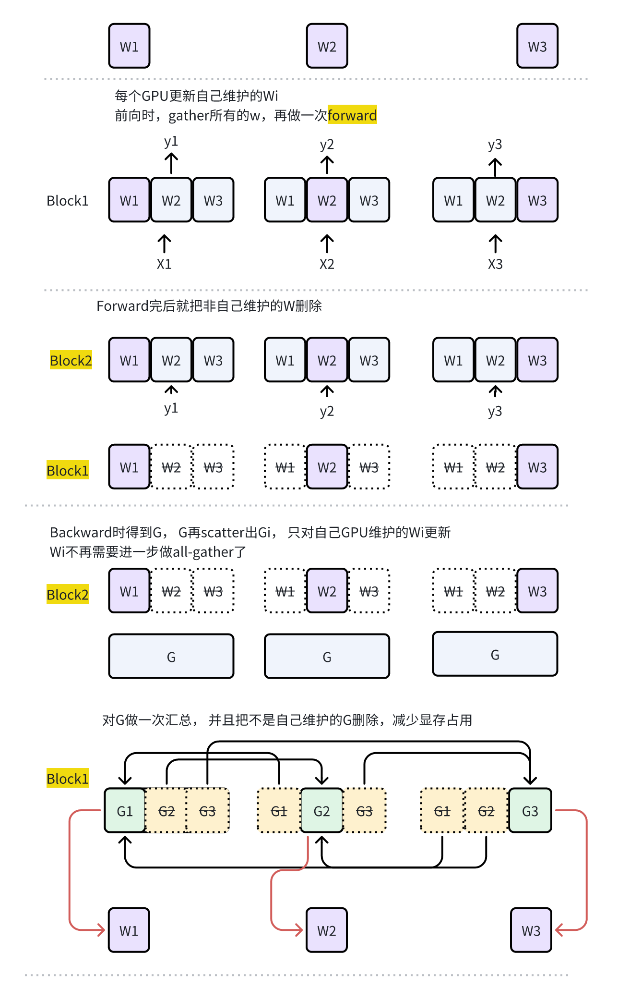

### 4.3 ZeRO Stage性能分析

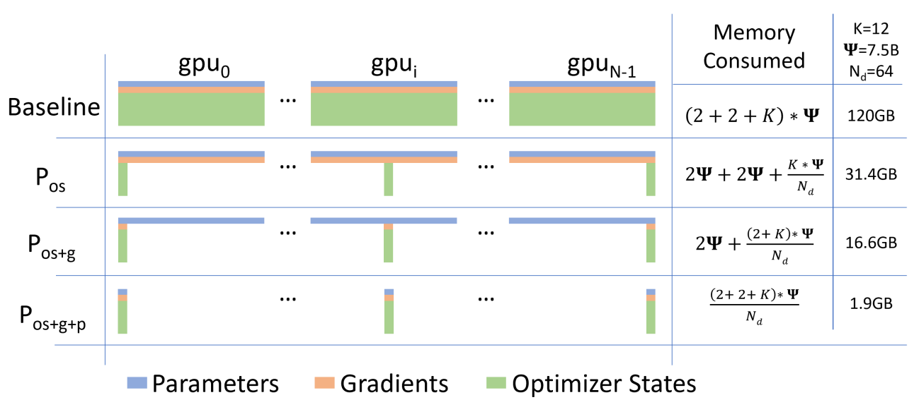

### 4.4 ZeRO  Feature

#### 4.4.1 ZeRo-Offload

> 核心思想
>
> GPU ： 负责farward和backward的矩阵运算，接受16位的paramter 
>
> CPU：负责参数的更参数float量化，传递给GPU

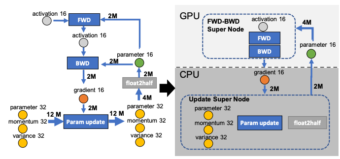

执行的时候可以参用流水线的形式进行

#### 4.4.2 ZeRO-Infinity

#### 4.4.3 ZeRO++

​	**Gradient Checkpoint** : 因为激活状态要用于backward的反向传播， 我们可以将activation的状态存储在内存当中，需要的时候再做一次farward，这样就可以减少显存

~~~json
## 设置deepspeed的【ds.json】文件，可以设定stage ， 也可以指定offload模型
{
  "train_micro_batch_size_per_gpu": "auto",
  "zero_optimization": {
    "stage": 3   ## 设置阶段
  }
}
~~~

~~~bash

~~~

## 5.张量并行 Tensor Parralelism

### 5.1 linear张量并行的计算原理

1. 行并行

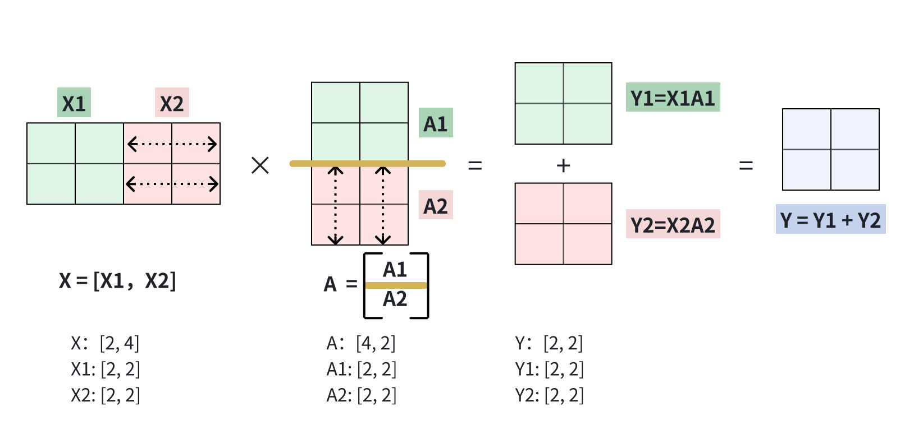

分拆 然后加和

2. 列并行

   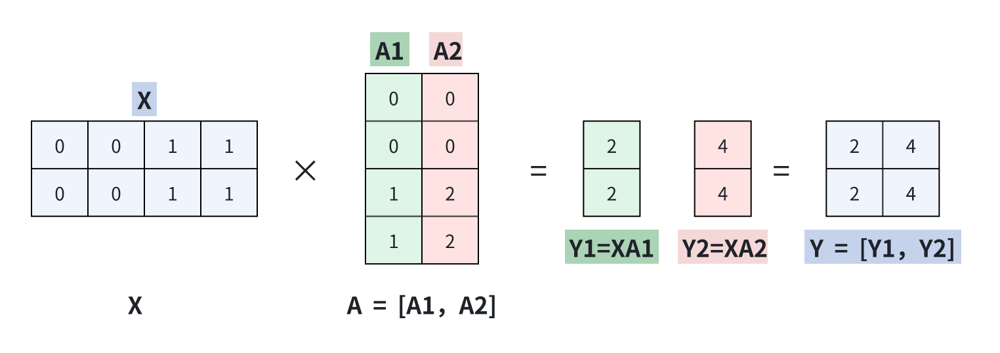

   总结  ： 行分拆，然后进行拼接

   ### 5.1 Megatron的实现与原理

   1. ParallelismMLP

   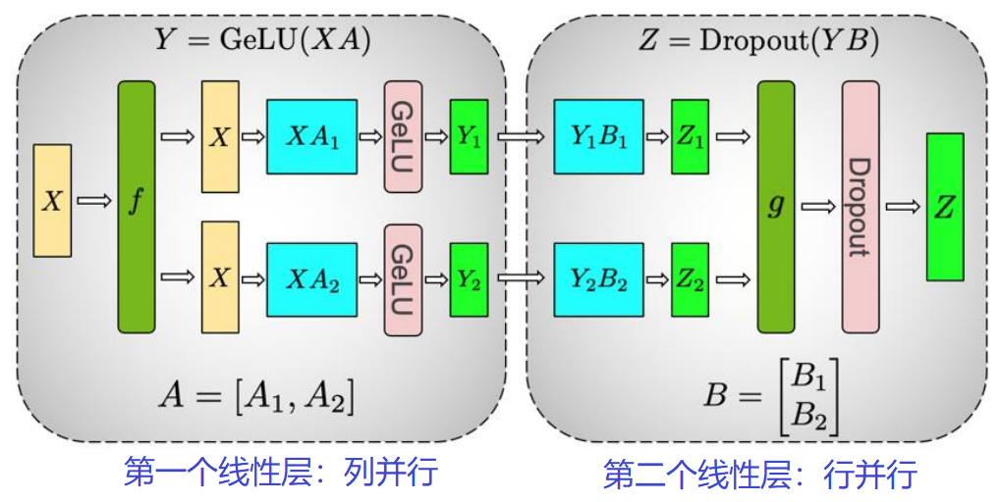

   **qusetion：为什么第一次要使用列并行 ？ **

   减少了一次caozuo

   2. ColumnParallelLinear

   

   3. RowParallelLinrea

   

## 6 流水线执行

## 7. Gradient Checkpoint

Activation Recomputing -> Gradient Checkpoint 保存部分反向传播计算需要的中间的结果

1. Traditional Train

- **farward ： **我们需要保存激活之前的中间的状态用于梯度的反向传播的计算

- **backward:** ： 使用loss 和 layer 层的中间状态去计算梯度

2. 使用Gradient checkpoint:

相当于保存部分的中间态，反向的时候再次计算一个邻近层的中间台，用时间去换空间

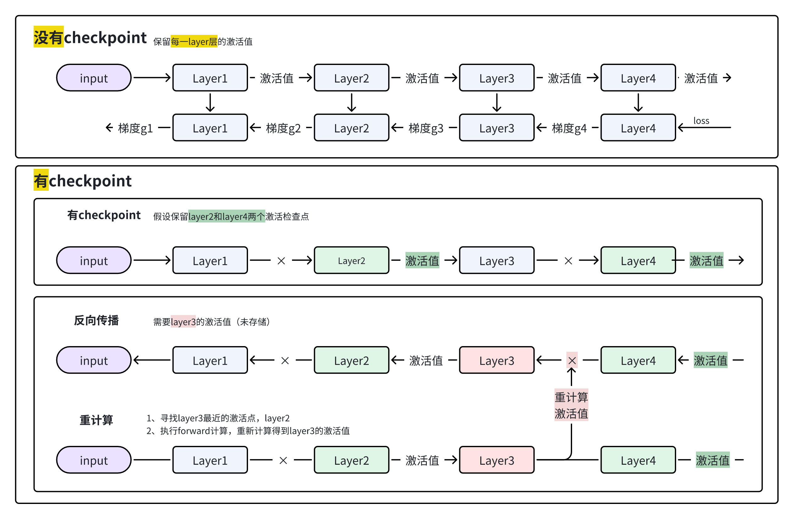

**transfomers 去调用 gradient checkpoint**

~~~python
trainer_cofig = TrainingArguments(
    			##########.... 其他的配置
				gradient_checkpointing = True)
# ------------------------------或者

model.gradient_checkpointing_enable()
model.config.use_cache = False
~~~

## 8 混合精度训练

