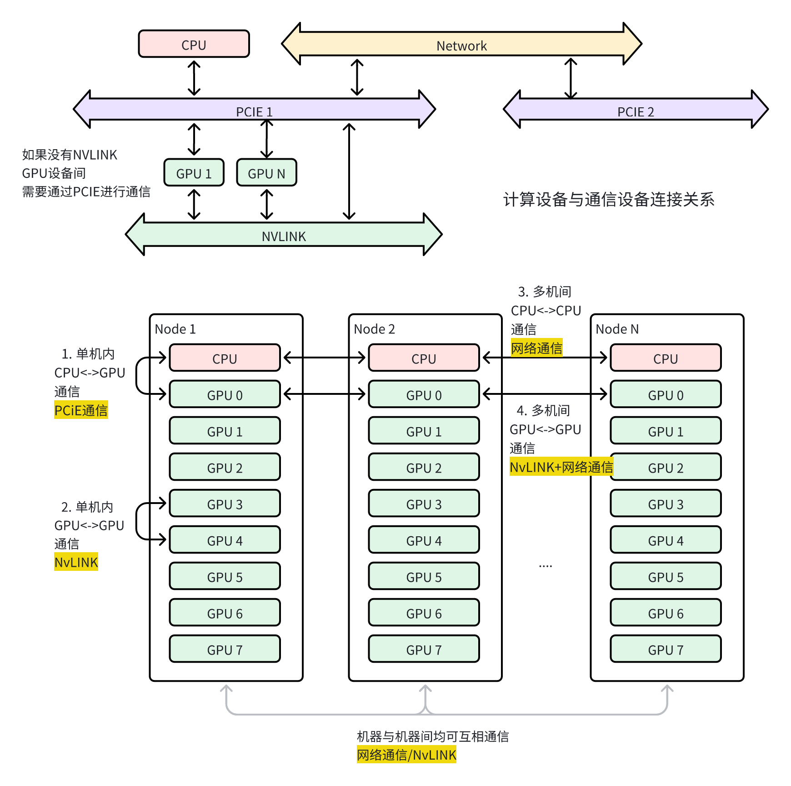
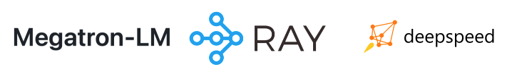
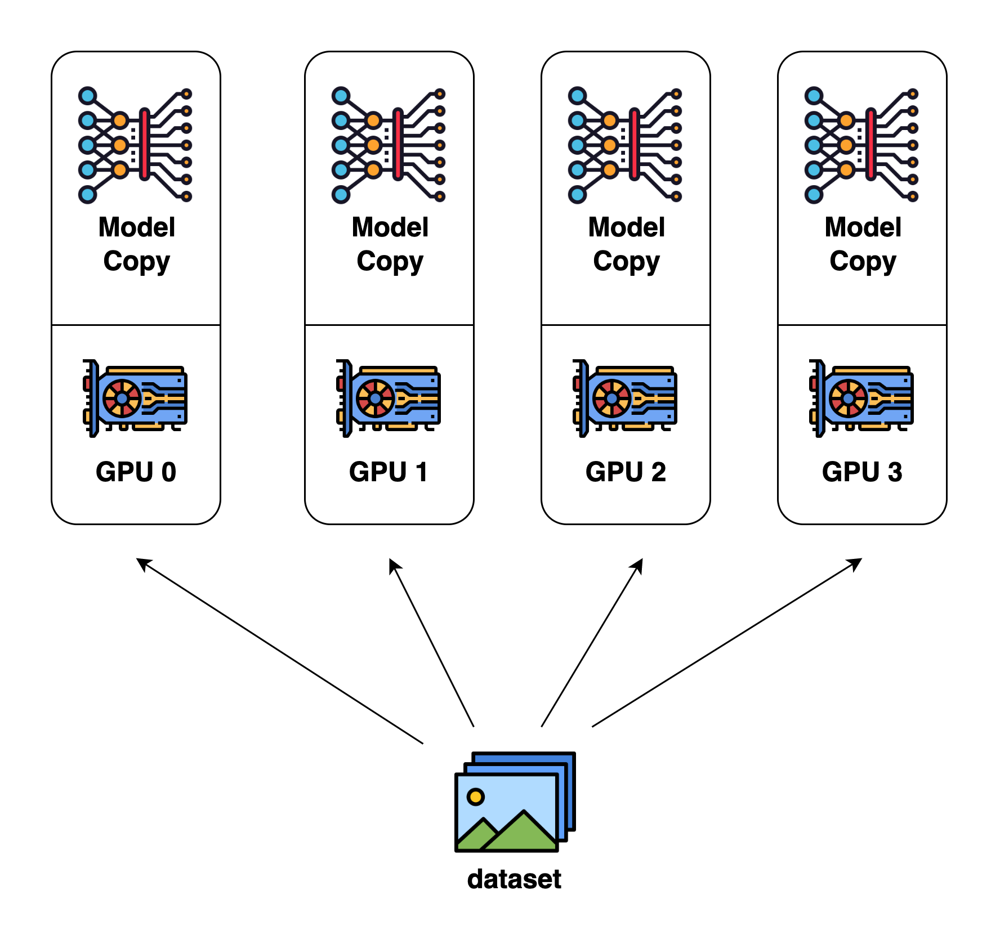
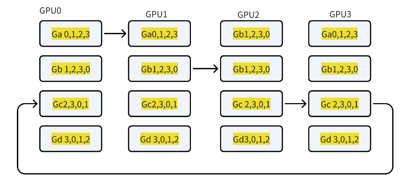
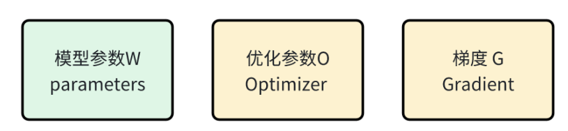

## 1.基本概念

### 1.1多机多卡的分布式训练

- 单机中**CPU** <-> **GPU** 通信 通过PCIe完成  ， 存在耗时

- 单机中**GPU** <-> **GPU** 多个数据，在不同卡训练需要进行**gratigent allgather(梯度全聚)** 使用NVLink进行通信

- 多机中**CPU** <-> **CPU** 通信 通过通信网络完成  ，例如 GPU1->CPU1->CPU2->GPU2

- 多机中**GPU** <-> **GPU** 通信 通过通信网络完成 ，不走CPU，NVLink直接在PEIe总线给不同GPU通信。

  

### 1.2显存占用问题

- **W**：模型参数，
  - **2byte**的静态参数权重->(16bit)
  - **2byte**的更新参数权重->(16bit)

- **O**：优化参数 ，
  - 以 adam为例 ，
  - **4byte**一阶动量优化器更新(Momentum) -> (32bit)
  - **4byte**二阶方差优化器(Variatnce)->(32bit)
- **G**：梯度 
  - **2byte**梯度 -> (16bit)
  - **2byte**梯度更新->(16bit)

- **activation** : 前向计算保存的激活值 ， 用于进行backward ，主要涉及到**Attention层**，**FFN模块的层**等，是占比较大的一部分
- **Temporary buffers** ： 用于保存梯度聚合
- **Unusable frament memory** ：显存的碎片

.png)

3. 显存优化的思路：

   以时间来换空间 

### 1.3显存优化的库以及方向

1. 常见的架构

2. 优化技术

- 多卡的数据并行
- 多机分布式并行
- ZeRO零冗余优化（优化显存，提高训练的吞吐量）
- 流水线并行
- 张量并行
- RLHF并行训练

### 1.4分布式训练的目标

- 精度方面：

混合精度的fp32/fp16

异步梯度更新，非全局SGD

- 速度

GPU利用率的计算

完成的一个分布式系统训练一个完整LLM的时间

单位时间内训练  tokens/s

## 2.数据并行

> ​	这是一种最常见的并行形式，构建的形式比较简单。在数据并行训练中，数据集会被分成几个碎片，每个碎片会分配到一个GPU设备上。这相当于将批次进行了并行化处理。相应的在模型上面不进行操作，每个模型持有一个完成的模型的参数，并在分配的数据集碎片上进行训练。在反向传播之后，模型的梯度将收集起来，累聚起来然后进行参数的处理。

### 2.1 数据并行图示例

- step1： 所有GPU加载的模型**权重w**是一样的，不同的数据计算不同 $x_i$ 并得到 $ G_i $ 
- step2：主节点**GPU1**当**server**来汇总**(AllReduce)**所有的梯度，并反向传播给所有GPU的w更新权重

.png)

**限制之处：**

- **GPU1**在汇总梯度的时候，需要承担通信负载的时间，其他的GPU节点只能进行等待。
- 如果通信耗时为$t$，有$n$个节点，那么n个梯度传递时间为$(n-1)t$ ，将Gradient回传又花费$(n-1)t$  ,总共的耗时为$2(n-1)t$ ，这个时间其余的节点也在等待。

### 2.2 数据并行的实现-Pytorch DataPalleral

~~~python
from torch.nn.parallerl import DistributedDataParallel as DDP
#.... 前置配置
device_id = rank % torch.cuda.device_count()
model = model.to(device_id)
ddp_model = DDP(model , device_ids = [decide_id])
~~~

## 3.分布式并行

### 3.1 异步并行

> ​	数据并行的策略中GPU1通信耗时会造成性能瓶颈，所以分布式并行的改进策略计划就可以从下面的方面去进行改进：
>
> 1. $GPU_{2-N}$可以用来分担通信耗时 -> 使得不同的$GPU_i$来作为server
> 2. 在通信的过程中，其他非server的节点也可以进行计算

.png)

​	图示展示的关键步骤为：我们依次让不同的节点作为server。每个server进行(All Reducing)，只让每个server的模型参数w进行更新，其余的照旧计算新的数据。

**限制之处：**

- GPU数量增大的时候，异步的步调会很大， 导致结果的W差异会比较大， 会难以收敛

### 3.2 分布式数据并行Ring-AllReduce(常用)

两个阶段的 **reduce-scatter** 和 **all-gather**

####  3.2.1 数据切分 

>  ​	同数据并行一样，将batch的数据分布式的放在若干个节点上面，在将每个节点的数据再分成若干个rank，每次以rank来计算

.png)

2. reduce-scatter

   -1722766651919-7.png)

   

- step1：每个卡里面负责处理不同的minibatch

- step2：从不同的起始位置开始进行运算

- step3：若干步之后得到mini的梯度

- step4：然后我们需要把完整的梯度all-gather出去

执行N步之后得到：

.png)

3. Allgather

.png)

- 此时将已经算好的完整的梯度来去替换过去运算的以前的梯度

执行N步之后得到：

- 此时对所有节点的权重去进行一次梯度更新，便完成了所有weight的同步的更新
- GPU运行的过程中基本上没有多余的空闲时间

### 3.3 Ring-Reduce的性能分析

- gradient的都是小量的(scatter)，计算量等同于未分块数据之前的计算量
- 每次传播的通信数据量都是很小量的(scatter)，传播量等同于未分块前的传播量

## 4.DeepSpeed ZeRO并行

### 4.1 模型训练显存占用分析

**ZeRO**:(Zero Redundancy Optimizer) 称为**零冗余优化 **，是deepspeed的关键算法。

- 分布式数据并行的方式会实现的比较简单，所以有了广泛的应用，但是数据并行会产生大量冗余的model state的大量冗余空间占用。

- ZeRo 的优化在数据并行的基础上，同时还引入了**model state**的改进

  

>以参数量为Ψ的模型：
>
>- **Float16**的**参数**和**梯度** 分别消耗了 2Ψ + 2Ψ bytes的字节，
>
>- **Float32**的**参数**、**Monmentum**和**Variance** 分别消耗了 3 * 4Ψ的字节  总计为16Ψ - Bytes的内存	
>
>因此一个LLAMA-70B的模型，至少需要1000GB显存，如果数据并行的形势下，这个会复制N分，用于不同的显卡当中。

### 4.2 ZeRo-3 Stage

1. **ZeRO-1: ** 分割**Optimizer State ** —–> 内存使用减少4x
2. **ZeRO-2: ** 分割**Optimizer State** 和 **Gradient **—–> 内存使用减少7.x
3. **ZeRO-3: ** 分割**Optimizer State **、**Gradient **和 **Parameters**—–> 内存使用减少4x

.png)

#### 4.2.0 数据的切分

- 将原始的参数铺平成为1维

- 每个worker 根据自己的rank找到自己在一维中的起始和终止位置， 然后拷贝相应的数据

#### 4.2.1 ZeRO-1

.png)

假设我们有$N_d$个并行的进程，**ZeRO-1** 会将完整优化器的状态等分成 $N_d$ 份并储存在各个进程中。当 Backward，完成之后，每个进程的**Optimizer**:

- 对自己储存的**Optimizer States(包括 Momentum、Variance 与 FP32 Master Parameters) **进行计算与更新。
- 更新过后的 **Partitioned FP32 Master Parameters **会通过 All-gather 传回到各个进程中。
- 完成一次完整的参数更新。

#### 4.2.2 ZeRO-2 

.png)

在一个 Layer 的 `Gradient` 都被计算出来后：

- `Gradient` 通过 `AllReduce` 进行聚合。
- 聚合后的梯度只会被某一个进程用来更新参数，因此其它进程上的这段 `Gradient` 不再被需要，可以立马释放掉。(只保留自己需要)

#### 4.2.3 ZeRO-3

.png) 

​	ZeRO-3 通过对 `Optimizer States`、`Gradient` 和 `Model Parameter` 三方面的分割，从而使**所有进程共同协作，只储存一份完整 Model States**。其核心思路就是**精细化通讯**，按照计算需求做到参数的收集和释放。

##### 4.2.3.1 初始化

​	一个模型由多个 `Submodule` 组成。在初始化时，ZeRO-3 会将**每个** `Submodule Parameter Tensor` 下的数据按照 GPU 的数量，**分摊切割**成多个小 `ds_tensor` 储存在在不同 GPU 进程中。因为 `ds_tensor` 可以共同组合出完整数据，所以原始 `param` 下的数据变为冗余信息，会被释放掉。

##### 4.2.3.2 训练中

​	在训练过程中，ZeRO-3 会按照 `Submodule` 的计算需求进行参数的收集和释放：

​	在当前 `Submodule` 正向/反向传播**计算前**，ZeRO-3 通过 `All-gather` 拿到分摊储存在不同进程中的 `ds_tensor`，重建原始的 `param`。重建之后的参数就可以参与计算。

​	在当前 `Submodule` 正向/反向传播计算后，`param` 下的数据并没有发生变更，与 `ds_tensor` 相同，造成了冗余。因此，`param` 会再次被释放。

### 4.4 ZeRO  Feature

#### 4.4.1 ZeRo-Offload

> 核心思想
>
> GPU： 负责farward和backward的矩阵运算，接受16位的paramter 
>
> CPU：负责参数的更新和参数float量化，传递给GPU

.png)

**单卡流水线管理** ：在swap的过程中，compution stream仍可高效计算

.png)

#### 4.4.2 ZeRO-Infinity

.png)

> 这种方法可能更适合部署在，将内存和显存共享的运算单位上面，会有效率的提升。

#### 4.4.3 ZeRO++

> ZeOR++ 是对ZeRO3的通信量的优化，
>
> 有下面三方面改进：
>
> 1. 每个服务器有完整的模型参数，消除跨服务器的All_gather操作；
>
> 2. 通信时，基于块的量化，模型参数从FP16转换成INT8；
>
> 3. 替代ring-based ReduceScatter通信，改为分层级的量化 AllToALL；

1. **Quantized Weight Communucation for ZeRO(qwZ)**

.png)

通过将参数分块，每个block里面进行量化操作，减少存储 和  加快传递，量化误差小

2. **Hierarchical  Partitioning for ZeRO(hpZ)**

.png)

在GPU内保存完整的参数，减少参数的Gather

3. **Quantized Gradients Communication for ZeRO(qgZ)**

.png)

梯度的量化操作

4. **流水线执行**

.png)

运用流水线的方式去进行信息的传递，减少了训练时间

##### deepspeed.json的示例

**json配置**

~~~json
### ZeRO++ 配置文件
{
    "zero_optimization": {
        "stage": 3,
        "reduce_bucket_size": 10000000,
        "reduce_scatter": true,

        "zero_quantized_weights": true,
        "zero_hpz_partition_size": 16,
        "zero_quantized_gradients": true,

        "contiguous_gradients": true,
        "overlap_comm": true
    }
}
## ZeRO 可以变为 1 , 2 , 3
{
  "train_micro_batch_size_per_gpu": "auto",
  "zero_optimization": {
    "stage": 3   ## 设置阶段
  }
}

~~~

**py示例**

~~~python
from transformers import TrainingArguments

training_args = TrainingArguments(
		...... ,
    	deepspeed = './config/deepspeed.json', ## 调用方法
		)
~~~

**bash示例**

~~~bash
deepspeed sample.py   ## 调用方法

... 待补充
~~~

### 4.5 对比试验 — 待补充

​	**Gradient Checkpoint** : 因为激活状态要用于backward的反向传播， 我们可以将activation的状态存储在内存当中，需要的时候再做一次farward，这样就可以减少显存

| QloRA | deepspeed | ZeRO | Flash-Attn2 | Gradient Checkpoint | Gradient Accumulation | batch_size | 显存占用 | 训练时间 | 备注 |
| ----- | --------- | ---- | ----------- | ------------------- | --------------------- | ---------- | -------- | -------- | ---- |
|       |           |      |             |                     |                       |            |          |          |      |

## 5.张量并行 Tensor Parralelism

### 5.1 linear张量并行的计算原理

#### 5.1.1 行并行(Row Parallelism)

$XA = [X_1 \ X_2] \begin{bmatrix} A_1 \\ A_2 \end{bmatrix}= X_1A_1+X_2A_2 = Y_1 + Y_2 = Y$

.png)

**流程有三步**

1. 首先将$X$ , $A$ 分拆为小的矩阵
2. 依次计算小矩阵的乘法 然后加和，这一部不同的GPU执行不同的矩阵乘法
3. 对结果进行求和然后对$Y_i$执行**all_reduce**操作，将分块的更新回去

#### 5.1.2列并行(Column Parallelism)

$XA = X \begin{bmatrix} A_1 & A_2 \end{bmatrix}= \begin{bmatrix} XA_1 & XA_2 \end{bmatrix} = \begin{bmatrix} Y_1 & Y_2 \end{bmatrix} = Y$

.png)

**流程有三步**

1. 首先将 $A$ 分拆为小的矩阵
2. 依次计算$X$与$A_i$矩阵的乘法，这一部不同的GPU执行不同的矩阵乘法
3. 对结果进行concat得到结果$Y$

总结  ： 行分拆，然后进行拼接

### 5.2 Megatron的实现与原理

#### 5.2.1ParallelismMLP

**Megatron** 的 **ParallelismMPL**包含了两个线性层，

- 第一个线性层**MLP1 **， 实现了**hidden size** 到 **4 x hidden size** 的转换
- 第二个线性层**MLP2 **， 实现了**4 x hidden size** 到 **hidden size** 的转换

.png)

每个线性层都可以进行行并列或者列并列。在Megatron中，

- 第一个线性层**MLP1 **：列并行
- 第一个线性层**MLP2**：行并行

.png)

**qusetion：为什么第一次要使用列并行 ？ **减少了一次通信操作

**两种方法对比**

.png)

#### 5.2 **ColumnParallelLinear**

有如下的步骤

- **f**：对输入进行处理，
  - **farward** ：**identity**操作，将输入的X切分分发给不同的GPU
  - **backward** ：**all-reduce **操作，将所有的梯度进行求和操作
- **g**：对输出进行处理，
  - **farward** ：**all-gather**操作，将输入的$Y_i$进行拼接，得到完整的**Y**
  - **backward** ：**split**操作，将所得的**Y**梯度进行拆分，分发给不同GPU

.png)

#### 5.3 **RowParallelLinrea**

有以下的步骤

- **f**：对输入进行处理，
  - **farward** ：**split**操作，将所得的X进行拆分，分发给不同GPU
  - **backward** ：**all-gather **操作，将所有的梯度进行拼接得到完整的梯度
- **g**：对输出进行处理，
  - **farward** ：**all-reduce**操作，将输入的$Y_i$进行求和，得到完整的**Y**
  - **backward** ：**identity**操作，返回各个卡的梯度

.png)

### 5.4 其他通用层张量并行

#### 5.4.1 VocabParallelEmbedding

为了让内存做到均衡分配，对embedding也会按照vocab的维度来切分操作，每个GPU上都有部分词表。

.png)

#### 5.4.2 ParallelAttention

.png)

## 6 流水线执行

### 6.1 模型并行Model Parallelism

- 当模型存储大于GPU显存时可以通过切分模型，在不同的GPU设备加载，通过时间换空间。
- 当LLM有80个Block模型在8个GPU上，可以按照顺序切分到8个GPU上
- 当其**Forward** 和 **Backward**是串行工作，因此会造成大量的**GPU运算空载**，也就是**Bubble**

.png)

### 6.2 流水线并行Pipeline Parallelism

- 流水线并行的目标是让**Bubble**更少，训练吞吐量更大
- 流行线并行，**Forward **过程**(Backward)**还未到来时，使得**F0可以算完4个batch**

.png)

### 6.3 DreamPipe

- DreamPipe进一步优化，使得**Forward+Backward**在单个GPU上往复运算
- 通常Forward和Backward耗时是不一致的，产生**idle**是，不可避免的。

**理想状况**

.png)

**实际情况**

.png)

## 7. Gradient Checkpoint

**Activation Recomputing **-> Gradient Checkpoint 保存部分反向传播计算需要的中间的结果

### 7.1 原理介绍

1. **Traditional Train**

- **farward ： **我们需要保存激活之前的中间的状态用于梯度的反向传播的计算

- **backward:** ： 使用**loss **和 **layer** 层的中间状态去计算梯度

2. **使用Gradient checkpoint**:

​	相当于保存部分的中间态，反向的时候再次计算一个邻近层的中间台，用时间去换空间

.png)

**transfomers 去调用 gradient checkpoint**

~~~python
## 方法1
trainer_cofig = TrainingArguments(
    			##########.... 其他的配置
				gradient_checkpointing = True)
# ------------------------------或者

## 方法2
model.gradient_checkpointing_enable()

~~~

